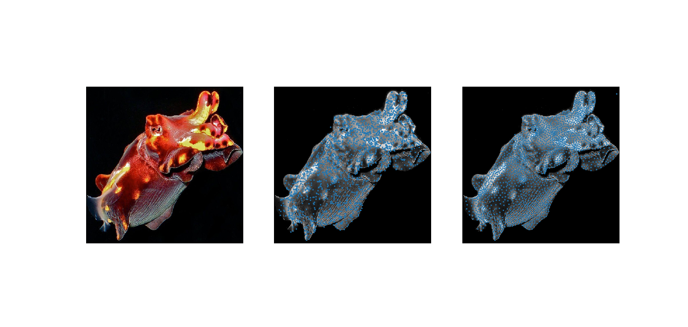
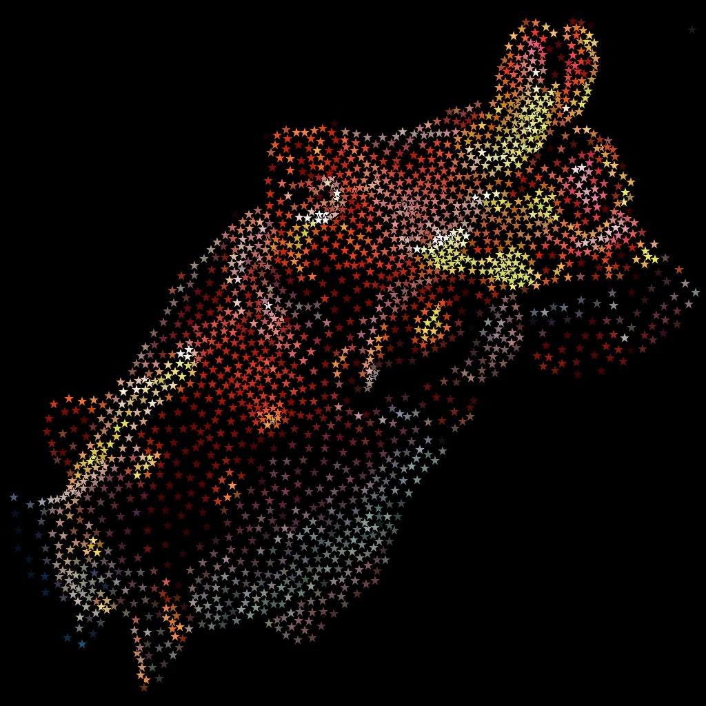

# weighted_voronoi_stippling
Based on a paper by Adrian Secord from 2002.

So you sample an initial distribution of points from a function (the image's luminosity, in this instance) via rejection sampling.
Then you perform several Lloyd relaxation steps using said function on those points.

These steps give the stippling effect. Now grab a black and white stencil. Stamp the stencil over the final points using the original color.

Tada!
